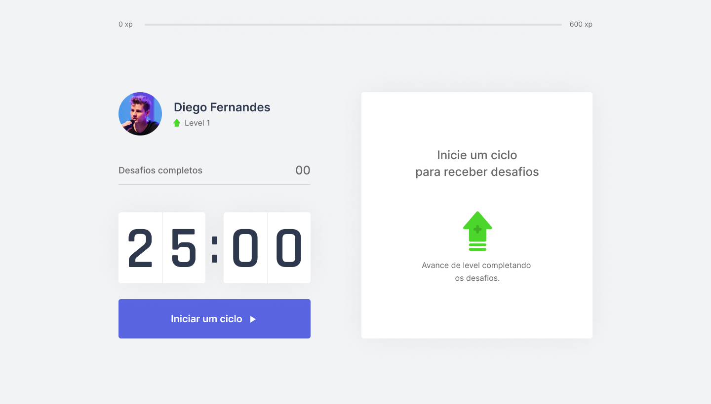
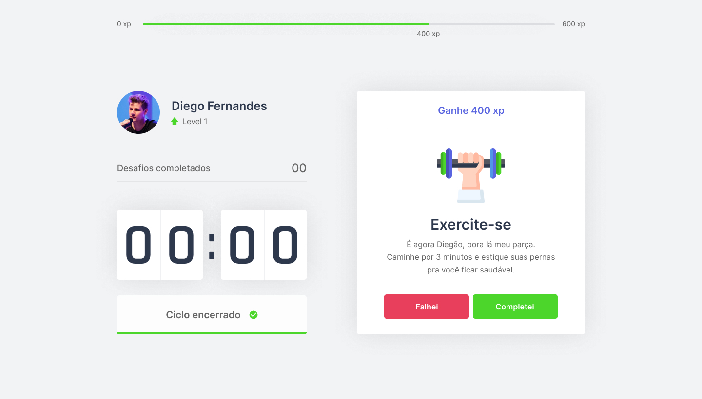
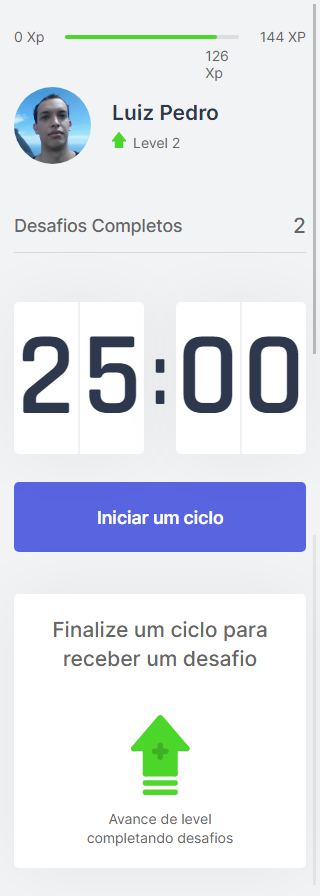

# MoveIt

<h1 align="center">
    
</h1>
<h2 align="center">
  <a href="https://reactjs.org/">
    
    
  </a>
</h2>

<p align="center">
  

  
  

  <a href="https://github.com/luizpedrosm/moveit/commits/master">
    
  </a>

  <a href="https://www.linkedin.com/in/luizpedrosm/">
    
  </a>

  
</p>

## 💻 Projeto

Aplicação feita em [Next.js] no [NLW]4.
O MoveIt visa ajudar os usuários a exercitar-se após o cronômetro de 25 min.
O app usa Gamificação criando desafios para adquirir experiência e subir de nível.

## - 🌐 Web

> moveit-next-luizpedrosm.vercel.app

### 🖥️ Desktop

<h1 align="center">
    
    
</h1>

### 📱 Mobile

<h1 align="center">
    
</h1>

## 🚀 Tecnologias

Esse projeto foi desenvolvido com as seguintes tecnologias:

- [Node.js](https://nodejs.org)
- [React](https://reactjs.org)
- [Next.js](https://nextjs.org)

## Getting Started

First, run the development server:

```bash
npm run dev
# or
yarn dev
```

Open [http://localhost:3000](http://localhost:3000) with your browser to see the result.

## Learn More

To learn more about Next.js, take a look at the following resources:

- [Next.js Documentation](https://nextjs.org/docs) - learn about Next.js features and API.
- [Learn Next.js](https://nextjs.org/learn) - an interactive Next.js tutorial.

You can check out [the Next.js GitHub repository](https://github.com/vercel/next.js/) - your feedback and contributions are welcome!

## Deploy on Vercel

The easiest way to deploy your Next.js app is to use the [Vercel Platform](https://vercel.com/new?utm_medium=default-template&filter=next.js&utm_source=create-next-app&utm_campaign=create-next-app-readme) from the creators of Next.js.

Check out our [Next.js deployment documentation](https://nextjs.org/docs/deployment) for more details.

[next.js]: https://nextjs.org/
[nlw]: https://nextlevelweek.com/
